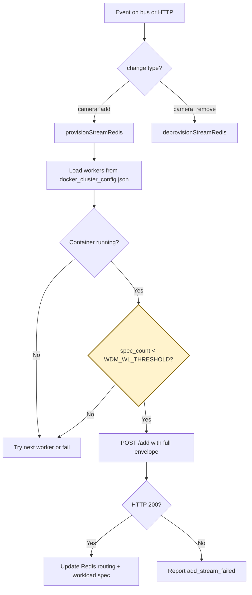

## Overview

SDRC is a coordinator and routing layer that manages which backend worker handles each live stream, and keeps that routing stable, scalable, and recoverable.

- Distribute streams across multiple workers (e.g. pods or containers)
- Track active stream assignments in Redis
- Call worker APIs like /add, /delete, and optionally /config
- Support Kafka or Redis as the message bus for event notification
- Autonomously restore stream sessions if a worker fails
- Expose APIs for discovery and management
- Integrate with Envoy so traffic for a given stream goes to the right pod

## Usage

The component enables collaboration between agents/pods/processes in applications like VST, metropolis, MTMC, ITS, ACE, and Tokkio. It allows dynamic context-aware scaling of stateful workloads across multiple Kubernetes pods and Docker containers and can be extended to baremetal processes on a distributed network.

## Architecture

A distributed stream orchestration and routing layer that assigns stream sessions to worker pods, tracks stream-to-pod state, and uses Envoy plus Redis/Kafka-backed coordination to route, scale, and recover workloads reliably.

<Frame caption="High-level SDR architecture.">
  
</Frame>

## SDRC Usage Modes (WDM_CLUSTER_TYPE)

| Mode | Description |
| --- | --- |
| **Docker** (`docker`) | SDRC runs with a fixed, statically defined set of worker containers described in a JSON configuration file and monitored through Docker-native mechanisms. It is simpler to stand up and is useful for controlled environments where the worker inventory is known in advance, but it does not support autoscaling, dynamic pod discovery, or automatic expansion and contraction of capacity. Operationally, scaling requires updating configuration and restarting components, so Docker mode is best suited for development, testing, or smaller deployments where flexibility and elasticity are less important than simplicity. |
| **Kubernetes** (`k8s`) | SDRC is designed for dynamic, production-style deployments in which workers run as a StatefulSet with stable DNS identities and optional Horizontal Pod Autoscaler (HPA) support. This mode enables automatic worker discovery, stable addressing, better stream-to-worker tracking, and reaction to scale-up, scale-down, and failure events. Compared with Docker mode, Kubernetes mode provides stronger resilience and automation, allowing SDRC to assign workloads across changing worker capacity, maintain routing consistency, and integrate more naturally with autoscaling and recovery workflows. |

## Docker/Docker compose mode

In Docker/Docker compose mode, SDRC runs with a fixed, statically defined set of worker containers described in a JSON configuration file and monitored through Docker-native mechanisms. It is simpler to stand up and is useful for controlled environments where the worker inventory is known in advance, but it does not support autoscaling, dynamic worker discovery, or automatic expansion and contraction of capacity. Operationally, scaling requires updating configuration and restarting components, so Docker mode is best suited for development, testing, or smaller deployments where flexibility and elasticity are less important than simplicity.

### How to set up statically defined worker containers

Use a **two-stack** layout: run worker containers first, then run the SDRC controller with `config.yml`, one or more `docker_cluster_config*.json` files, and the Docker socket mounted. The reference Compose tree in the WDM repository (`compose/`) demonstrates two Docker workloads (`docker-workload-a` and `docker-workload-b`), each with two static workers.

1. **Start the worker containers.**

   Define one Compose service per worker. Each service must set `container_name` to a unique value and listen on a unique port (for example `5000`, `5001` on workload A).

   ```bash
   docker compose -f testapp/compose.yaml up -d
   ```

   Example worker services: `wdm-python-testapp-a-1` (port `5000`), `wdm-python-testapp-a-2` (port `5001`), and matching names for workload B.

2. **Create `docker_cluster_config.json` (one file per workload if needed).**

   List every worker as a **top-level JSON key** (the Docker container name). Each value defines how SDRC provisions and routes to that worker:

   ```json
   {
     "wdm-python-testapp-a-1": {
       "provisioning_address": "<host-ip>:5000",
       "routing_address": "<host-ip>:5000",
       "process_type": "docker"
     },
     "wdm-python-testapp-a-2": {
       "provisioning_address": "<host-ip>:5001",
       "routing_address": "<host-ip>:5001",
       "process_type": "docker"
     }
   }
   ```

   `provisioning_address` is where SDRC calls worker lifecycle APIs (`/add`, `/delete`, and so on). `routing_address` is where Envoy or clients send stream traffic; it can differ from `provisioning_address` when HTTP and routing ports are split. Set `process_type` to `docker`.

| Field | Description |
| --- | --- |
| **Top-level key** (for example `wdm-python-testapp-a-1`) | Docker `container_name`. Must match a running container and an entry in `WDM_CLUSTER_CONTAINER_NAMES`. |
| **provisioning_address** | `host:port` SDRC uses to provision the worker. Ports must match the worker process and `WDM_TARGET_PORT_MAPPING` in `config.yml`. |
| **routing_address** | `host:port` used for request routing (Envoy upstream). Can match `provisioning_address` or use a different port when routing is split. |
| **process_type** | Must be `docker` for Docker-mode discovery. |

1. **Configure the workload in `config.yml`.**

   For each enabled workload block, set Docker mode and point at the cluster file:

   ```yaml
   docker-workload-a:
     wl_obj_name: wdm-python-testapp-a
     port: 4000
     WDM_MS_LISTENER_PORT: 9000
     enable: true
     WDM_CLUSTER_TYPE: docker
     WDM_CLUSTER_CONFIG_FILE: /docker_cluster_config-a.json
     WDM_CLUSTER_CONTAINER_NAMES: '["wdm-python-testapp-a-1","wdm-python-testapp-a-2"]'
     WDM_TARGET_PORT_MAPPING: '{"wdm-python-testapp-a-1": 5000, "wdm-python-testapp-a-2": 5001}'
     WDM_CONSUMER_GRP_ID: consumer-grp-id-workload-a
     WDM_REDIS_CACHE_OBJECT: wdm-python-testapp-a-data
     WDM_KFK_BOOTSTRAP_URL: "<host-ip>:29092"
     WDM_WL_REDIS_SERVER: <host-ip>
     WDM_WL_REDIS_PORT: 6379
     WDM_WL_ADD_URL: /add
     WDM_WL_CHANGE_ID_ADD: camera_add
     WDM_WL_DELETE_URL: /delete
     WDM_WL_THRESHOLD: 3
   ```

   Replace `<host-ip>` with the host address where Redis and Kafka listen (reachable from SDRC; with `network_mode: host`, this is typically the machine running Compose). Assign a **unique** `WDM_MS_LISTENER_PORT` per enabled workload block (for example `9000` for `docker-workload-a` and `9001` for `docker-workload-b`); SDRC generates a dedicated Envoy listener for each `wl_obj_name` from these values (see **Stream routing with built-in Envoy**). `WDM_TARGET_PORT_MAPPING` keys must match container names. Port values must match `provisioning_address` and the ports your worker containers listen on.

2. **Start SDRC with mounts and Docker socket access.**

   Mount `config.yml`, each `docker_cluster_config*.json`, and `/var/run/docker.sock` (required for the watcher to monitor container health). The reference stack runs `wdm-env-from-config` and `wait-for-docker-workloads` so SDRC starts only after Redis is reachable and every name in `WDM_CLUSTER_CONTAINER_NAMES` is running.

   Minimal SDRC service example. Mount paths are illustrative; use the conventions from your deployment profile.

   ```yaml
   services:
     sdrc:
       image: <sdrc-image>
       network_mode: host
       depends_on:
         wait-for-redis:
           condition: service_completed_successfully
         wait-for-docker-workloads:
           condition: service_completed_successfully
       environment:
         WDM_WORKLOADS_CONFIG: <mounted-workloads-config>
         OTEL_SDK_DISABLED: "true"
       volumes:
         - ./config.yml:<mounted-workloads-config>:ro
         - ./docker_cluster_config-a.json:<mounted-cluster-config-a>:ro
         - ./docker_cluster_config-b.json:<mounted-cluster-config-b>:ro
         - ./log:/logs
         - /var/run/docker.sock:/var/run/docker.sock
   ```

   Start the stack (including optional wait/init services in a full deployment):

   ```bash
   docker compose -f docker-compose.yaml up -d
   ```

   SDRC loads workloads from the path configured in `WDM_WORKLOADS_CONFIG` (`network_mode: host` in the reference stack).

### Provisioning event payload format

After workers and SDRC are running, stream assignment is driven by **provisioning event payloads** published on the message bus (Redis or Kafka) or sent with `POST /apply_metadata_payload`. This is separate from `docker_cluster_config.json`, which only defines static worker addresses.

SDRC expects a JSON **envelope** with metadata plus an inner object (by default the key `event` via `WDM_EVENT_OBJECT_FIELD`). The `change` field inside that object must match the change types configured in `config.yml` (for example `WDM_WL_CHANGE_ID_ADD: camera_add` in the reference `compose/config.yml`).

```json
{
  "alert_type": "camera_status_change",
  "created_at": "2023-01-20T21:50:36Z",
  "event": {
    "camera_id": "e0925d6f-9ef0-4cc4-9fc9-b5633d2cbbe1",
    "camera_name": "webcam_stream_01",
    "camera_url": "rtsp://192.168.33.229:30554/webrtc/e0925d6f-9ef0-4cc4-9fc9-b5633d2cbbe1",
    "change": "camera_add"
  },
  "source": "vst"
}
```

| Field | Description |
| --- | --- |
| **alert_type** | Event category (for example `camera_status_change`). Used for logging and routing context. |
| **created_at** | ISO 8601 timestamp when the event was created. |
| **event** (or **value**) | Inner object name is set by `WDM_EVENT_OBJECT_FIELD` (default `event`). Some preload files use `value` instead; the field name must match your `config.yml`. |
| **event.camera_id** | Stream or sensor ID. SDRC uses `WDM_WL_ID_FIELD` (default `camera_id`) as the unique key for allocation and Redis routing. |
| **event.camera_name** | Human-readable stream name (optional but commonly present). |
| **event.camera_url** | Source URL (for example RTSP or WebRTC) passed through to the worker. |
| **event.change** | Action type, compared against `WDM_WL_CHANGE_ID_ADD`, `WDM_WL_CHANGE_ID_DEL`, or `WDM_WL_CHANGE_ID_POD_CONFIGURE` (field name from `WDM_WL_CHANGE_FIELD`, default `change`). |
| **event.metadata** | Optional runtime configuration (codec, resolution, and so on) applied per stream. |
| **source** | Originating system (for example `vst`, `preload`). |

**Change types** (must match `config.yml`):

| `change` value | SDRC behavior |
| --- | --- |
| `camera_add` (reference Compose) | Allocate a worker and call `WDM_WL_ADD_URL` (for example `/add`) with the full envelope as the POST body. |
| `camera_remove` | Deprovision: call `WDM_WL_DELETE_URL` and clear routing state. |
| `camera_streaming` (common default) | Treat as an add/provision event when `WDM_WL_CHANGE_ID_ADD` is set to this value. |
| `config` | Worker configuration update via `/config` (regex-based allocation flows). |

### Payload application and worker selection

**How payloads are applied**

When an add event arrives (from Redis, Kafka, or `POST /apply_metadata_payload`), SDRC runs a provisioning pipeline:

1. **Parse and classify** the message. Read the inner object (`WDM_EVENT_OBJECT_FIELD`, default `event`) and compare `change` to `WDM_WL_CHANGE_ID_ADD` (for example `camera_add` in the reference Compose `config.yml`).
2. **Build the candidate worker list** from `docker_cluster_config.json`. Each top-level key becomes a worker with container name, host IP, port, and phase from Docker inspect (`Running` vs down).
3. **Select a worker** that is running and under the per-worker stream limit (see below).
4. **Apply the payload** by POSTing the full envelope JSON to `http://<provisioning_address><WDM_WL_ADD_URL>` (for example `http://10.127.22.222:5000/add`).
5. **On HTTP 200**, update Redis:

   - `HSET {wl_obj_name} {camera_id} → {container_name}` for Envoy stream routing
   - `HSET {wl_obj_name}-pod {container_name} → {host}` for upstream lookup
   - Workload spec cache (`WDM_REDIS_CACHE_OBJECT`) records which streams each worker owns

6. **Publish** an agent event on the configured bus and optionally call post-allocation webhooks.

Delete events (`WDM_WL_CHANGE_ID_DEL`) reverse the flow: locate the assigned worker, POST `WDM_WL_DELETE_URL`, remove Redis mappings, and drop the stream from the workload spec.



**Worker pool vs per-worker stream limit**

Two configuration files work together:

| Configuration | Role |
| --- | --- |
| `docker_cluster_config.json` | **Static worker pool**: which containers exist and their `provisioning_address` / `routing_address`. SDRC only assigns streams to workers listed here. Adding capacity means adding a JSON entry and a running container. |
| `config.yml` → `WDM_WL_THRESHOLD` | **Max streams per worker**: upper bound on concurrent streams on one container. The reference Compose stack sets `WDM_WL_THRESHOLD: 3`. This value is **not** stored in the cluster JSON file. |

SDRC tracks how many streams each worker already owns in the Redis workload spec (`WDM_REDIS_CACHE_OBJECT`, for example `wdm-python-testapp-a-data`). `getSpecCount(container_name)` returns that count before each add.

**How an eligible worker is selected**

For each add event, SDRC iterates workers from `docker_cluster_config.json` in file order and picks the **first** worker that passes all checks:

1. **Container is running** — Docker inspect reports `Running`; down workers are skipped. If all workers are down, the add is deferred.
2. **Under capacity** — `spec_count < WDM_WL_THRESHOLD`. Workers at the threshold are skipped (saturated).
3. **Stream not already on this worker** — If the stream ID is new, any worker with free capacity can be chosen. If the stream already has a workload spec entry on a worker, SDRC can add to that same worker when it still has capacity.

The chosen worker's `provisioning_address` (host and port from the cluster JSON) is used for the `/add` call. Ports must stay aligned with `WDM_TARGET_PORT_MAPPING` and the ports your worker containers listen on.

**Example** (reference Compose, `WDM_WL_THRESHOLD: 3`, two workers in `docker_cluster_config-a.json`):

- Workers `wdm-python-testapp-a-1` and `wdm-python-testapp-a-2` each accept up to 3 streams.
- Streams 1–3 fill `a-1` first (listed first in JSON); stream 4 goes to `a-2` if `a-1` is saturated.
- A 7th stream fails with `add_stream_failed` (no autoscale).

**When no worker is available**

If every worker is saturated or down, SDRC logs `Max streams reached` and does not provision. Increase `WDM_WL_THRESHOLD`, add workers to the cluster JSON, add more worker containers in Compose, and restart SDRC.

Envoy continues to route client traffic using the Redis mapping written after a successful add. The `routing_address` in cluster JSON is used for xDS/upstream discovery; it may differ from `provisioning_address` when routing and lifecycle APIs use different ports.

To **add another worker**, create the worker service in Compose, add a JSON entry with matching `provisioning_address` / `routing_address`, extend `WDM_CLUSTER_CONTAINER_NAMES` and `WDM_TARGET_PORT_MAPPING`, then recreate the SDRC stack. Docker mode does not autoscale; changes require config updates and restart.

## Kubernetes mode

In Kubernetes mode, SDRC is designed for dynamic, production-style deployments in which workers run as a StatefulSet with stable DNS identities and optional Horizontal Pod Autoscaler (HPA) support. This mode enables automatic worker discovery, stable addressing, better stream-to-worker tracking, and reaction to scale-up, scale-down, and failure events. Compared with Docker mode, Kubernetes mode provides stronger resilience and automation, allowing SDRC to assign workloads across changing worker capacity, maintain routing consistency, and integrate more naturally with autoscaling and recovery workflows.

### How to set up defined worker containers

Workers are **StatefulSet pods** (for example `python-testapp-testapp-0`, `python-testapp-testapp-1`). SDRC discovers them through the Kubernetes API using a **ServiceAccount** token mounted into the coordinator pod. You do not use `docker_cluster_config.json`.

The manifests below are **self-contained**. You do not need a separate `kubernetes/` source tree or any other repository layout—save each block to a file in your working directory and apply with `kubectl`.

**Before you start**

- A **worker StatefulSet** is already running (or you deploy one using your own manifests). For this example:

  - **StatefulSet name:** `python-testapp-testapp` (must match `wl_obj_name` in the ConfigMap below)
  - **Headless Service** for stable pod DNS (`clusterIP: None`)
  - **Per-pod ports** aligned with `WDM_TARGET_PORT_MAPPING`: HTTP `5000`, gRPC `50051`, WebSocket `5050`
  - **NVCR pull secret** named `nvcr-io-registry-secret` in the same namespace (create with your NGC API key if images are private)
- **Redis** and **Kafka** are reachable from the SDRC pod at the hostnames you set in the ConfigMap.

1. **Create RBAC for in-cluster SDRC** (`sdrc-rbac.yaml`).

   Grants list/watch on pods and StatefulSets and permission to patch StatefulSet scale when workers are saturated.

   ```yaml
   apiVersion: v1
   kind: ServiceAccount
   metadata:
     name: sdrc-svcaccount
     labels:
       app.kubernetes.io/name: sdrc
       app.kubernetes.io/component: coordinator
   ---
   apiVersion: rbac.authorization.k8s.io/v1
   kind: Role
   metadata:
     name: sdrc-api-role
     labels:
       app.kubernetes.io/name: sdrc
   rules:
     - apiGroups: [""]
       resources: ["pods", "pods/status", "services", "configmaps"]
       verbs: ["get", "list", "watch"]
     - apiGroups: ["apps"]
       resources: ["deployments", "statefulsets", "replicasets"]
       verbs: ["get", "list", "watch"]
     - apiGroups: ["apps"]
       resources: ["statefulsets/scale"]
       verbs: ["get", "patch", "update"]
   ---
   apiVersion: rbac.authorization.k8s.io/v1
   kind: RoleBinding
   metadata:
     name: sdrc-api-binding
     labels:
       app.kubernetes.io/name: sdrc
   roleRef:
     apiGroup: rbac.authorization.k8s.io
     kind: Role
     name: sdrc-api-role
   subjects:
     - kind: ServiceAccount
       name: sdrc-svcaccount
   ```

2. **Create the workload ConfigMap** (`sdrc-configmap.yaml`).

   Set `wl_obj_name` to your worker StatefulSet name if it differs from `python-testapp-testapp`. Assign a **unique** `WDM_MS_LISTENER_PORT` per enabled workload block (`9000` in this single-workload example; use `9001`, `9002`, and so on when you add more `wl_obj_name` entries). SDRC generates Envoy listeners from these values at startup (see **Stream routing with built-in Envoy**). Adjust the Redis and Kafka sample values to match your cluster (in-cluster Service DNS names are shown below).

   ```yaml
   apiVersion: v1
   kind: ConfigMap
   metadata:
     name: sdrc-config
     labels:
       app.kubernetes.io/name: sdrc
       app.kubernetes.io/component: coordinator
   data:
     config.yml: |
       k8s-workerset1:
         wl_obj_name: python-testapp-testapp
         port: 4001
         WDM_MS_LISTENER_PORT: 9000
         enable: true
         WDM_CONSUMER_GRP_ID: consumer-grp-id-workload-a
         WDM_REDIS_CACHE_OBJECT: python-testapp-a-data
         WDM_TARGET_PORT_MAPPING: '{"default": 5000, "grpc": 50051, "websocket": 5050}'
         WDM_CLUSTER_TYPE: k8s
         WDM_KFK_BOOTSTRAP_URL: "kafka:29092"
         WDM_WL_REDIS_SERVER: redis
         WDM_WL_REDIS_PORT: 6379
         WDM_WL_ADD_URL: /add
         WDM_WL_CHANGE_ID_ADD: camera_add
         WDM_WL_DELETE_URL: /delete
         WDM_WL_THRESHOLD: 3
   ```

3. **Deploy the SDRC coordinator** (`sdrc-deployment.yaml`).

   Runs the SDRC controller with the in-cluster API token, mounts `sdrc-config`, and exposes the controller on port `5002`.

   ```yaml
   apiVersion: apps/v1
   kind: Deployment
   metadata:
     name: sdrc
     labels:
       app.kubernetes.io/name: sdrc
       app.kubernetes.io/component: coordinator
   spec:
     replicas: 1
     selector:
       matchLabels:
         app.kubernetes.io/name: sdrc
     template:
       metadata:
         labels:
           app.kubernetes.io/name: sdrc
           app.kubernetes.io/component: coordinator
       spec:
         serviceAccountName: sdrc-svcaccount
         imagePullSecrets:
           - name: nvcr-io-registry-secret
         containers:
           - name: sdrc
             image: <sdrc-image>
             imagePullPolicy: IfNotPresent
             ports:
               - name: http
                 containerPort: 5002
             env:
               - name: WDM_WORKLOADS_CONFIG
                 value: <mounted-workloads-config>
             volumeMounts:
               - name: config
                 mountPath: <mounted-config-directory>
                 readOnly: true
               - name: logs
                 mountPath: /logs
             readinessProbe:
               tcpSocket:
                 port: http
               initialDelaySeconds: 15
               periodSeconds: 10
             livenessProbe:
               tcpSocket:
                 port: http
               initialDelaySeconds: 30
               periodSeconds: 20
             resources:
               requests:
                 cpu: 250m
                 memory: 512Mi
               limits:
                 memory: 2Gi
         volumes:
           - name: config
             configMap:
               name: sdrc-config
           - name: logs
             emptyDir: {}
   ```

4. **Expose SDRC inside the cluster** (`sdrc-service.yaml`).

   ```yaml
   apiVersion: v1
   kind: Service
   metadata:
     name: sdrc
     labels:
       app.kubernetes.io/name: sdrc
       app.kubernetes.io/component: coordinator
   spec:
     type: ClusterIP
     selector:
       app.kubernetes.io/name: sdrc
     ports:
       - name: http
         port: 5002
         targetPort: http
   ```

5. **Apply and verify.**

   ```bash
   kubectl apply -f sdrc-rbac.yaml -f sdrc-configmap.yaml -f sdrc-deployment.yaml -f sdrc-service.yaml
   kubectl get deploy,po,svc -l app.kubernetes.io/name=sdrc
   ```

   To run SDRC **outside** the cluster instead, use the same `config.yml` body from the ConfigMap, mount it into the SDRC controller container, and supply `KUBERNETES_HOST`, `KUBERNETES_PORT`, `KUBERNETES_JWT_TOKEN`, and cluster CA paths yourself.

6. **Send provisioning events.**

   Use the same payload format as Docker mode (see **Provisioning event payload format** and **Payload application and worker selection**). SDRC assigns each stream to a pod where `spec_count < WDM_WL_THRESHOLD`.

To add worker capacity, increase `replicas` on your worker StatefulSet and redeploy, or configure HPA.

## Stream id routing with built-in Envoy

SDRC includes an **Envoy proxy** that forwards client traffic to the worker currently assigned to each stream. After a successful add event, SDRC writes the stream-to-worker mapping in Redis (see **Payload application and worker selection**). Clients do not call worker addresses directly for routed traffic—they connect to the **Envoy listener port** for the target `wl_obj_name` and identify the stream in request headers.

### Envoy listener generation

SDRC does not use a single shared ingress port. When the Envoy routing layer starts:

- Reads `config.yml` and generates one Envoy **listener** per workload block that defines both `WDM_MS_LISTENER_PORT` and `port`.
- Configures per-listener stream lookup with that block's `wl_obj_name` as the default `X-WL-OBJECT-NAME`, so each workload gets its own dedicated listener port (for example `:9000` for one workload, `:9001` for another).
- Starts Envoy with that generated configuration.
- Publishes **xDS cluster definitions** via REST CDS on the controller port (default `5002`) so Envoy knows how to reach each worker per `WDM_TARGET_PORT_MAPPING`.
- Exposes a separate **direct listener** (default `8010`, overridable with `WDM_SDRC_DIRECT_LISTENER_PORT`) that forwards `/sdrc` paths to the SDRC controller without stream routing.

### Request routing

Clients send HTTP requests to the **listener port** for their workerset (`WDM_MS_LISTENER_PORT` for that `wl_obj_name`). Envoy routes each request to the correct worker in that set using an **HTTP header**:

- `ENVOY_ROUTE_HEADER`: per-workload header name carrying the **stream ID**. Generated Envoy defaults this header name to `x-stream-id` when the workload block does not set it. VSS profile configs set `ENVOY_ROUTE_HEADER: streamid`.

On each request, the routing layer reads the stream ID header, looks up `HGET {wl_obj_name} {stream_id}` in Redis, and forwards the request to the assigned worker (container or pod). If the stream is not provisioned or the header is missing, routing fails.

flowchart LR
  C[Client HTTP request] -->|route header = stream ID| E[Envoy listener]
  E -->|Redis lookup in workerset| R[(Redis)]
  R -->|worker in set| W[Assigned worker]

Replace `<sdrc-host>` with the host where Envoy listens. Replace `<listener-port>` with `WDM_MS_LISTENER_PORT` for the target `wl_obj_name`. Replace `<route-header>` with the workload block's `ENVOY_ROUTE_HEADER` value, or `x-stream-id` when it is omitted. Replace `<stream-id>` with a provisioned `camera_id`.

### Test HTTP routing with curl

After you provision a stream, send HTTP through Envoy:

```bash
curl -sS \
  -H "<route-header>: <stream-id>" \
  "http://<sdrc-host>:<listener-port>/hello"
```

In VSS profiles, VIOS stream processing uses `streamid` as the route header. After SDRC provisions a stream, clients can route through the SDRC Envoy listener by sending that header:

```bash
curl -sS \
  -H "streamid: <stream-id>" \
  "http://<sdrc-host>:<listener-port>/hello"
```

This pattern gives clients a stable listener endpoint. Clients do not need to discover the worker pod or container that currently owns the stream; SDRC keeps the stream-to-worker mapping in Redis and Envoy uses the route header to forward each request to the right worker, even after scaling or recovery.

Use `<listener-port>` = `WDM_MS_LISTENER_PORT` for the `wl_obj_name` you provisioned (for example `9000` for `k8s-workerset1` when that block sets `WDM_MS_LISTENER_PORT: 9000`). The path `/hello` matches the reference testapp; your worker may expose a different path.

Optional flags: `curl -v` for verbose output, `curl -i` to include response headers.

**Common issues**

- **503 / no upstream**: Stream ID not provisioned, missing route header, wrong listener port for the `wl_obj_name`, or Redis mapping missing.

## SDRC APIs

This section summarizes the HTTP and routing APIs exposed by an SDRC deployment. SDRC provides a controller/router API, per-workload coordinator APIs, generated stream-routing listeners, and operational endpoints.

Use the controller/router API for management, discovery, dashboard, and proxy access to workload coordinators. Use per-workload listener ports for stream-routed application traffic.

### Start here

New developers should think of SDRC as three API layers:

1. **Controller/router APIs** answer questions about the whole SDRC deployment. Use them to find workloads, inspect health, view the dashboard, fetch OpenAPI docs, and proxy into a specific workload coordinator.
2. **Workload coordinator APIs** answer questions about one workload set. Use them to inspect assigned streams, pod/container state, replica status, Redis mappings, and stream lifecycle actions for a single `wl_obj_name`.
3. **Per-workload Envoy listeners** route application traffic. Use them only after a stream has been provisioned and the client can send the configured stream ID header.

#### Common first calls

| Goal | Call | Notes |
| --- | --- | --- |
| Open interactive API docs | `GET http://<sdrc-host>:<controller-port>/api/docs/` | Start here when exploring available controller APIs. |
| List enabled workloads | `GET http://<sdrc-host>:<controller-port>/` | Returns workload names and proxied `/sdrc` paths. |
| Check all workload health | `GET http://<sdrc-host>:<controller-port>/dashboard/health` | Fast deployment-level health summary. |
| Check one workload | `GET http://<sdrc-host>:<controller-port>/sdrc/<wl_obj_name>/healthz` | Confirms that a specific workload coordinator is reachable. |
| See streams assigned to one workload | `GET http://<sdrc-host>:<controller-port>/sdrc/<wl_obj_name>/current_distributed_streams_name_id_url` | Shows active stream IDs and cached event payloads. |
| See worker placement for one workload | `GET http://<sdrc-host>:<controller-port>/sdrc/<wl_obj_name>/pod_list` | Shows pods/containers and assigned stream IDs. |
| Send routed application traffic | `GET http://<sdrc-host>:<WDM_MS_LISTENER_PORT>/<worker-path>` with `<route-header>: <stream-id>` | Use the listener port for the target workload and the route header configured for that workload. |

#### Placeholder guide

| Placeholder | Meaning |
| --- | --- |
| `<sdrc-host>` | Hostname or IP for the SDRC controller/router service. |
| `<controller-port>` | Controller/router port. Default deployments use `5002`; Helm profiles may expose `5003`. |
| `<wl_obj_name>` | Workload set name. Examples in VSS profiles include stream-processing or realtime-CV workload names. |
| `<sdrc-host>` | Hostname or IP for the SDRC Envoy listener. |
| `<WDM_MS_LISTENER_PORT>` | Per-workload listener port from the workload configuration. |
| `<route-header>` | Header that carries the stream ID. Many VSS profiles use `streamid`; deployments that do not override it use `x-stream-id`. |
| `<stream-id>` | Provisioned stream or sensor ID, commonly the event's `camera_id`. |
| `<worker-path>` | HTTP, gRPC, or WebSocket path exposed by the backend worker, such as a health, inference, or stream-processing path. |

#### URL patterns

Use these patterns to choose the correct entry point:

```text
Controller/router API:
http://<sdrc-host>:<controller-port>/<controller-endpoint>

Workload coordinator API through controller/router:
http://<sdrc-host>:<controller-port>/sdrc/<wl_obj_name>/<workload-endpoint>

Workload coordinator API through that workload's Envoy listener:
http://<sdrc-host>:<WDM_MS_LISTENER_PORT>/sdrc/<workload-endpoint>

Stream-routed application traffic:
http://<sdrc-host>:<WDM_MS_LISTENER_PORT>/<worker-path>
header: <route-header>: <stream-id>
```

#### Request body quick reference

Most read-only endpoints use `GET` and do not require a request body. Mutating and discovery endpoints use `POST`. Set `Content-Type: application/json` for JSON bodies.

| Endpoint | Body | Typical result |
| --- | --- | --- |
| `POST /dashboard/global_add?transport=redis\|kafka` | Full lifecycle payload. Use the same shape as **Provisioning event payload format**. | Publishes the payload to the selected bus. Returns JSON with transport details on success. |
| `POST /sdrc/<wl_obj_name>/apply_metadata_payload` | Full lifecycle payload. The inner event object must contain the configured stream ID field and change field. | Calls provision, reprovision, deprovision, or configure logic for that workload. |
| `POST /sdrc/<wl_obj_name>/cache_metadata_update` | `{"stream_id": "<stream-id>", "additional_metadata": {...}, "overwrite": false, "cache_key": "external_metadata"}` | Updates metadata stored with the cached stream record. |
| `POST /sdrc/<wl_obj_name>/remove_stream` | `{"stream_id": "<stream-id>"}` | Deprovisions the stream and removes its assignment. |
| `POST /v3/discovery:routes` | Optional: `{"resource_names": ["<wl_obj_name>"]}` | Returns Envoy route discovery resources. This endpoint is intended for Envoy/control-plane use. |
| `POST /v3/discovery:clusters` | No body required. | Returns Envoy cluster discovery resources. This endpoint is intended for Envoy/control-plane use. |

#### Status code guide

| Status | Meaning |
| --- | --- |
| `200` | Request succeeded. |
| `400` | Invalid request body, wrong `Content-Type`, unsupported query option, or required field missing. |
| `404` | Unknown workload, missing route resource, or stream not found. |
| `500` | Internal processing, Redis, Kafka, Kubernetes, or worker lifecycle error. |
| `502` | Router proxy could not reach the workload coordinator. |
| `503` | Requested transport or route is not configured, or routed application traffic does not have a resolvable upstream. |

### Runtime API surfaces

| Surface | Default endpoint | Purpose |
| --- | --- | --- |
| SDRC controller / router | `http://<sdrc-host>:5002/` by default; Helm profiles may expose this as service port `5003`. | Multi-workload controller API, dashboard, OpenAPI document, xDS endpoints, and `/sdrc/<wl_obj_name>/...` proxy to each workload coordinator. |
| Direct SDRC Envoy listener | `http://<sdrc-host>:8010/` by default; Helm profiles may expose this as service port `8011`. | Envoy listener that forwards requests without an `upstream-cluster` header directly to the SDRC controller. Use this for controller access when the controller port is not exposed directly. |
| Per-workload Envoy listener | `http://<sdrc-host>:<WDM_MS_LISTENER_PORT>/`. | Stream-routing listener generated from each enabled workload block. `/sdrc/...` paths go to SDRC APIs; other paths route to the assigned worker using the configured stream ID header. |
| Envoy admin | `http://<sdrc-host>:9901/` by default; Helm profiles may expose this as service port `9902`. | Envoy diagnostics and configuration inspection. Treat this as an operational/admin interface, not an application API. |

### Controller and router APIs

The controller/router APIs are served on the controller port. They are also reachable through the direct Envoy listener. The generated Swagger UI for this surface is available at `/api/docs/` and the machine-readable OpenAPI document is available at `/openapi.json`.

| Method | Path | Purpose |
| --- | --- | --- |
| `GET` | `/api/docs/` | Interactive Swagger UI for the controller/router API. |
| `GET` | `/openapi.json` | OpenAPI 3.0 document for the controller/router API. |
| `GET` | `/` | JSON index with enabled workload names, proxied `/sdrc` paths, and documentation links. |
| `GET` | `/dashboard` | HTML dashboard for viewing workload state and sending test/global add payloads. |
| `GET` | `/dashboard/health` | Per-workload health, sensor count, and pod count summary. |
| `GET` | `/dashboard/clusterxds` | Cluster discovery output for dashboard inspection. |
| `GET` | `/dashboard/config_yml` | Mounted `config.yml` path and content. |
| `POST` | `/dashboard/global_add?transport=redis\|kafka` | Sends a JSON lifecycle payload to the configured Redis stream or Kafka topic. |
| `POST` | `/v3/discovery:clusters` | Envoy Cluster Discovery Service (CDS) response for enabled workloads and their worker endpoints. |
| `POST` | `/v3/discovery:routes` | Envoy Route Discovery Service (RDS) response. Optional JSON body: `{"resource_names": ["<wl_obj_name>"]}`. |
| `GET`, `POST`, `PUT`, `PATCH`, `DELETE`, `HEAD`, `OPTIONS` | `/sdrc/<wl_obj_name>/<path>` | Proxies the request to the named workload coordinator. For example, `/sdrc/vss-vios-streamprocessing/healthz` forwards to that coordinator's `/healthz` endpoint. |

### Workload coordinator APIs

Each enabled workload has an internal coordinator. The coordinator listens on the workload block's `port` value and is usually accessed through the router path `/sdrc/<wl_obj_name>/<endpoint>`. On a per-workload Envoy listener, the shorter form `/sdrc/<endpoint>` is rewritten to that workload's router path.

The generated Swagger UI for a workload coordinator is available at `/sdrc/<wl_obj_name>/api/docs/` through the controller/router, and the workload's OpenAPI document is available at `/sdrc/<wl_obj_name>/openapi.json`.

<Warning>
`GET /reset` has destructive side effects even though it is exposed as a `GET` endpoint. Do not link to it from pages, crawlers, health checks, browser previews, or prefetching clients.
</Warning>

| Method | Workload path | Purpose |
| --- | --- | --- |
| `GET` | `/api/docs/` | Interactive Swagger UI for this workload coordinator. |
| `GET` | `/openapi.json` | OpenAPI 3.0 document for this workload coordinator. |
| `GET` | `/` | HTML page with non-sensitive runtime configuration keys. |
| `GET` | `/healthz` | Health check. Returns `OK` on success. |
| `GET` | `/reset` | Clears workload spec/cache state and optionally clears the preload file. This is destructive. |
| `GET` | `/get_config` | Current allocation configuration from the worker discovery layer. |
| `GET` | `/replicas` | Workload object name and ready/desired replica counts. |
| `GET` | `/getwl?id=<stream-id>` | Cached workload specification for a stream ID. |
| `GET` | `/getpoddns?id=<stream-id>` | Pod/container name and DNS mapping for a stream ID. |
| `POST` | `/v3/discovery:routes` | Single-workload Envoy route discovery response. |
| `POST` | `/v3/discovery:clusters` | Single-workload Envoy cluster discovery response. |
| `GET` | `/stream` | Continuous stream of ready replica counts. |
| `GET` | `/current_distributed_streams_cache` | List of all cached stream specifications for this workload. |
| `GET` | `/current_distributed_streams_name_id_url` | Map of stream ID to the cached event payload for each active stream. |
| `GET` | `/current_streamid_address_mapping` | Redis stream ID to assigned pod/container mapping. |
| `GET` | `/redis_cache_data` | Full workload cache object name and cache contents. |
| `POST` | `/cache_metadata_update` | Merge or overwrite metadata in a cached stream record. Requires JSON body with `stream_id` and `additional_metadata`; optional fields are `overwrite` and `cache_key`. |
| `GET` | `/metrics` | Prometheus metrics, including per-pod stream count. |
| `POST` | `/apply_metadata_payload` | Applies an event payload immediately. The payload uses the configured event field, stream ID field, and change values described in **Provisioning event payload format**. |
| `POST` | `/remove_stream` | Deprovisions a stream by JSON body `{"stream_id": "<stream-id>"}`. |
| `GET` | `/get_wl_replica_data` | Replica and pod saturation summary, including running, standby, engaged, saturated, and pending pod counts when available. |
| `GET` | `/pod_list` | Pods/containers for this workload with phase, address, and assigned stream IDs. |
| `GET` | `/down_pods` | Non-running pods/containers with phase, address, and assigned stream IDs. |
| `GET` | `/getpodInfo?id=<stream-id>` | Disaggregated pod details for the pod/container currently assigned to a stream ID. |

### Stream-routing API behavior

Per-workload Envoy listeners are application traffic entry points, not only management APIs. For non-`/sdrc` paths, the listener expects the configured route header to contain a provisioned stream ID. The SDRC routing layer looks up the stream-to-worker assignment in Redis and forwards the request to the assigned worker.

Use these rules when calling through a per-workload listener:

- `/sdrc/<endpoint>` reaches the workload coordinator API for that listener's `wl_obj_name`.
- Any other path, such as `/hello` or a workload-specific inference path, is routed to a worker only when the stream ID resolves to an assigned worker.
- Send the stream ID in the configured route header. If the header is absent, the listener can also read the stream ID from a query parameter with the same name, for example `?streamid=<stream-id>` when the route header is `streamid`.
- If `NOHEADERTARGETROUTE` is `true` for the workload, headerless non-`/sdrc` requests route to that workload's configured `HEADERLESS_SERVICE_ENDPOINTS` cluster.
- gRPC and WebSocket requests use the same stream-to-worker lookup, with Envoy selecting protocol-specific clusters from `WDM_TARGET_PORT_MAPPING` when those mappings are configured.
- Routed listener responses include cross-origin headers for browser and dashboard clients.

### Operational and security notes

- The current SDRC Flask APIs do not implement application-level authentication or rate limiting. Expose them only on trusted networks or behind an authenticated gateway.
- Treat `/reset`, `/apply_metadata_payload`, `/remove_stream`, `/cache_metadata_update`, and `/dashboard/global_add` as administrative mutation APIs.
- `/dashboard/config_yml` returns the mounted workload configuration. Do not expose it where configuration values, hostnames, or operational topology should remain private.
- `/stream` is an unbounded streaming response; use it for diagnostics rather than high-frequency polling.
- Envoy admin should stay private to operators. It can expose runtime configuration and diagnostics.
- `/static/*.json` may serve older bundled Swagger JSON files, but `/openapi.json` is the generated API description for the running deployment.

## Using SDRC in VSS Profiles

SDRC solves the stateful stream placement and routing problem in VSS profiles. A VSS stream should have a stable logical controller and, when routing is enabled, a stable Envoy listener even if the backend worker container or pod changes because of scaling, restart, or recovery. SDRC consumes stream events, selects a worker with available capacity, calls that worker's add/delete APIs, stores the stream-to-worker assignment in Redis, and lets Envoy route stream traffic by stream ID.

The two primary VSS workload object types managed through SDRC are:

- `vss-vios-streamprocessing`: manages VIOS stream processing and proxy-stream workflows. VSS profiles commonly route this workload through Envoy using `streamid` as the route header.
- `vss-rtvi-cv`: manages realtime CV/perception workers. SDRC is used for worker discovery, capacity-aware stream placement, stream add/delete lifecycle, and recovery. Profiles that expose rtvi-cv traffic through Envoy also define listener and target-port mapping for this workload.

### Docker Compose profiles

- For Docker paths in this section, `$VSS_APPS_DIR` means `video-search-and-summarization/deploy/docker`.
- VSS includes the SDRC Docker service from `$VSS_APPS_DIR/services/infra/sdrc/docker-compose.yaml`. The service starts with the SDRC workload config rendered from the active VSS profile.
- Profile-local SDRC configs live under paths such as `$VSS_APPS_DIR/developer-profiles/dev-profile-alerts/sdrc/` and `$VSS_APPS_DIR/industry-profiles/warehouse-operations/warehouse-2d-app/sdrc/`.
- Start with the active profile's `sdrc/configs/config.yml.tmpl`. That file tells you which workload blocks are enabled and which worker objects SDRC manages.
- For `vss-vios-streamprocessing`, check the block in small groups:

  - **Identity:** `wl_obj_name` identifies the streamprocessing workload.
  - **Docker worker inventory:** `WDM_CLUSTER_CONFIG_FILE` points to the worker inventory file, and `WDM_CLUSTER_CONTAINER_NAMES` names the worker containers SDRC watches.
  - **Stream lifecycle:** `WDM_WL_ADD_URL` and `WDM_WL_DELETE_URL` define how SDRC adds/removes streams; `WDM_WL_THRESHOLD` defines per-worker capacity.
  - **Event mapping:** `WDM_EVENT_OBJECT_FIELD`, `WDM_WL_ID_FIELD`, and `WDM_WL_REDIS_MSG_FIELD` tell SDRC where to find the stream ID in incoming events.
  - **Routing:** `port` and `WDM_MS_LISTENER_PORT` create the generated Envoy listener; `ENVOY_ROUTE_HEADER` is usually `streamid`; `WDM_TARGET_PORT_MAPPING` maps Envoy traffic to the worker port.
  - **Headerless fallback:** `NOHEADERTARGETROUTE` and `HEADERLESS_SERVICE_ENDPOINTS` control where requests go when they arrive without the route header.

- For `vss-rtvi-cv`, check the block in small groups:

  - **Identity:** `wl_obj_name` identifies the rtvi-cv workload.
  - **Docker worker inventory:** `WDM_CLUSTER_CONFIG_FILE` and `WDM_CLUSTER_CONTAINER_NAMES` should point to the rtvi-cv worker set.
  - **Stream lifecycle and capacity:** confirm whether the profile overrides or relies on defaults for `WDM_WL_ADD_URL` and `WDM_WL_DELETE_URL`; set `WDM_WL_THRESHOLD` for the intended worker capacity.
  - **Event and bus settings:** validate Redis/message-bus keys and fields such as `WDM_REDIS_MSG_KEY`, `WDM_WL_REDIS_MSG_FIELD`, and `WDM_CONSUMER_GRP_ID`.
  - **Routing, if enabled:** check `port`, `WDM_MS_LISTENER_PORT`, and `WDM_TARGET_PORT_MAPPING`. Profiles that use rtvi-cv only for placement/lifecycle may not expose it as a routed client-facing listener.

- The Docker service exposes fixed runtime ports for the controller, direct `/sdrc` listener, and Envoy admin. Per-workload listener ports are generated from the active SDRC config only for workload blocks that define both `port` and `WDM_MS_LISTENER_PORT`.
- For less common tuning knobs, see **Advanced customization parameters**.

### Helm profiles

- In Helm, the VSS profile selects an SDRC config file such as `configs/sdrc/config-verification.yml` and renders it into an SDRC ConfigMap.
- The infra SDRC chart owns the controller pod, RBAC, and Services. The profile-owned config still controls which workloads are managed and how Envoy listeners are generated.
- When VIOS sensor is configured to use SDRC as its stream processor, its stream processor endpoint resolves to the SDRC controller service on port `5003`.
- For `vss-vios-streamprocessing`, check the block in small groups:

  - **Identity:** `wl_obj_name` should match the Kubernetes streamprocessing workload.
  - **Kubernetes worker discovery:** `WDM_CLUSTER_TYPE` selects Kubernetes mode, and the workload identity must match the worker object SDRC discovers.
  - **Stream lifecycle:** `WDM_WL_ADD_URL` and `WDM_WL_DELETE_URL` define how SDRC adds/removes streams; `WDM_WL_THRESHOLD` defines per-worker capacity.
  - **Event mapping:** `WDM_EVENT_OBJECT_FIELD`, `WDM_WL_ID_FIELD`, and `WDM_WL_REDIS_MSG_FIELD` tell SDRC where to find the stream ID in incoming events.
  - **Routing:** `port` and `WDM_MS_LISTENER_PORT` create the generated Envoy listener; `ENVOY_ROUTE_HEADER` is usually `streamid`; `WDM_TARGET_PORT_MAPPING` maps Envoy traffic to the worker port.
  - **Headerless fallback:** `NOHEADERTARGETROUTE` and `HEADERLESS_SERVICE_ENDPOINTS` control where requests go when they arrive without the route header.

- For `vss-rtvi-cv`, check the block in small groups:

  - **Identity:** `wl_obj_name` should identify the rtvi-cv worker object.
  - **Kubernetes worker discovery:** confirm the worker object exists and matches the SDRC workload identity.
  - **Capacity and lifecycle:** validate `WDM_WL_THRESHOLD` and any add/delete behavior the profile sets or inherits.
  - **Event and bus settings:** validate Redis/message-bus keys and fields such as `WDM_REDIS_MSG_KEY`, `WDM_WL_REDIS_MSG_FIELD`, and `WDM_CONSUMER_GRP_ID`.
  - **Routing, if included:** check `port`, `WDM_MS_LISTENER_PORT`, `WDM_TARGET_PORT_MAPPING`, and `NOHEADERTARGETROUTE`. Alert verification profiles include an rtvi-cv workload block; realtime-only profiles may only include streamprocessing.

- For less common tuning knobs, see **Advanced customization parameters**.

The SDRC chart's `service.yaml` creates Services only for the controller, the direct `/sdrc` listener, and Envoy admin:

| Service port | Default | Purpose |
| --- | --- | --- |
| `controller` | `5003` | SDRC controller API used by VSS components. |
| `sdrc-direct` | `8011` | Direct listener for `/sdrc` paths, separate from stream routing. |
| `admin` | `9902` | Envoy admin and diagnostics port. |

Workload listener ports are not declared in the Helm chart's `service.yaml`. They come from the mounted SDRC config: each enabled workload block that defines both `port` and `WDM_MS_LISTENER_PORT` produces a generated Envoy listener inside the SDRC pod. Add a Service or Ingress for those generated listener ports only when another component must reach them through Kubernetes service discovery.

## Autonomous stream session restoration on worker failure

SDRC runs a background **pod/container watcher** that monitors worker health (Docker container state via the Docker socket, or Kubernetes pod phase via the API). When a worker in a set stops or becomes unavailable, SDRC performs **autonomous stream session restoration**: it moves the affected stream sessions onto another healthy worker in the same workerset without client intervention.

### Failure detection

When the watcher reports that a worker is down:

- SDRC publishes a **critical** event on the configured message bus (Redis or Kafka) for the affected `wl_obj_name` and worker name.
- SDRC reads the **workload spec cache** (`WDM_REDIS_CACHE_OBJECT`) for that worker and collects the stream payloads it was running.
- If `WDM_CONTROLLER_REPROVISION` is `true` (default), SDRC initiates **autonomous stream session restoration** for each affected stream so placement runs again.

In **Docker mode**, restoration triggers when the down container matches names in `WDM_DOCKER_CLUSTER_POD_DOWN_NAMES` or `WDM_DOCKER_CLUSTER_KEY_DOWN_NAMES` (see your `config.yml`). In **Kubernetes mode**, restoration triggers when a StatefulSet pod enters a failed or terminated state.

### Restoration sequence

For each stream session on the failed worker, SDRC runs the same placement logic as an add event:

1. **Deprovision** the stream on the failed worker (`WDM_WL_DELETE_URL`) and remove its Redis routing entries.
2. **Select a new worker** in the set that is running and under `WDM_WL_THRESHOLD`.
3. **Provision** the stream on the new worker (`WDM_WL_ADD_URL`) with the stored event payload.
4. **Update Redis** so Envoy routes the stream header to the new worker.

Clients keep sending requests to the same listener port and route header; after restoration completes, Envoy forwards traffic to the replacement worker without client changes.

flowchart TD
  W[Worker down detected] --> S[Load stream specs from cache]
  S --> D[Deprovision on failed worker]
  D --> P[Restore session on healthy worker]
  P --> R[Update Redis routing]
  R --> E[Envoy routes stream header to new worker]

## SDRC Parameters

The following parameters are set in the SDRC workload configuration unless noted as deployment-level. Start with the minimum tables, then use the advanced groups only when a profile needs more control.

### Minimum required parameters

Set these explicitly for each new SDRC workload. Source defaults exist for some of them, but many defaults are demo-oriented and should not be treated as deployment recommendations. Start with deployment mode and workload discovery because those settings determine how SDRC finds workers in Docker Compose or Helm/Kubernetes profiles.

#### Deployment mode and workload discovery

Use this set to tell SDRC where its workload config is mounted, which workload block it is managing, and how workers are discovered in Docker Compose or Helm/Kubernetes profiles.

| Parameter | Summary |
| --- | --- |
| **WDM_WORKLOADS_CONFIG** | Deployment-level path to the mounted SDRC workload configuration. VSS profiles set this through Docker or Helm deployment wiring. |
| **wl_obj_name** | Workload set name. In Kubernetes, this should match the worker StatefulSet name. In Docker, this identifies the logical worker group. |
| **port** | Local SDRC controller port for this workload block. Each enabled workload should use a unique value. |
| **WDM_CLUSTER_TYPE** | Worker discovery mode: `docker` for Docker Compose profiles or `k8s` for Kubernetes/Helm profiles. |
| **WDM_CLUSTER_CONFIG_FILE** | Docker mode only. Path to the worker inventory JSON that lists worker `provisioning_address` values. |
| **WDM_CLUSTER_CONTAINER_NAMES** | Docker mode only. JSON array of worker container names SDRC monitors for health and restart events. |
| **WDM_WL_KIND** | Helm/Kubernetes mode. Kubernetes owner kind SDRC uses when finding worker pods; commonly `StatefulSet`. |
| **WDM_WL_CONFIG_PORT** | Worker API port used for add/delete calls in Kubernetes mode, or whenever the worker API port differs from the source fallback. |

#### Stream management

Use this set when SDRC needs to consume stream events, choose a worker, call add/delete APIs, and maintain stream-to-worker state.

| Parameter | Summary |
| --- | --- |
| **WDM_WL_THRESHOLD** | Maximum concurrent stream sessions per worker. SDRC skips workers that have reached this capacity. |
| **WDM_WL_REDIS_SERVER** / **WDM_WL_REDIS_PORT** | Redis host and port used for stream events, stream-to-worker mappings, workload cache, and operational messages. |
| **WDM_REDIS_CACHE_OBJECT** | Redis hash for this workload's stream placement cache. Use a unique value per workload. |
| **WDM_REDIS_MSG_KEY** | Redis stream name SDRC consumes for stream lifecycle events. |
| **WDM_WL_REDIS_MSG_FIELD** | Field in each Redis stream item that contains the JSON event payload. |
| **WDM_CONSUMER_GRP_ID** | Consumer group for this workload. Use a unique value per workload so consumers do not steal each other's events. |
| **WDM_KFK_ENABLE** | Set `false` for Redis-only input. Set `true` only when the workload should also consume Kafka. |
| **WDM_WL_ADD_URL** / **WDM_WL_DELETE_URL** | Worker HTTP paths SDRC calls to add or remove a stream after placement decisions. |
| **WDM_EVENT_OBJECT_FIELD** | Payload field containing the inner stream event object, commonly `event`. |
| **WDM_WL_ID_FIELD** | Field inside the event object used as the stream ID, commonly `camera_id`. |
| **WDM_WL_CHANGE_FIELD** | Field inside the event object that carries the lifecycle action, commonly `change`. |
| **WDM_WL_CHANGE_ID_ADD** / **WDM_WL_CHANGE_ID_DEL** | Values in `WDM_WL_CHANGE_FIELD` that mean add and delete for this workload. |

#### Envoy routing

Add these only when clients will send workload traffic through SDRC's generated Envoy listener instead of calling workers directly.

| Parameter | Summary |
| --- | --- |
| **WDM_MS_LISTENER_PORT** | Unique Envoy listener port for this `wl_obj_name`. Clients send routed workload traffic to this port. |
| **WDM_TARGET_PORT_MAPPING** | JSON map of worker listener ports. Use `default` for normal HTTP traffic and add `grpc` or `websocket` only when the workload exposes those protocols. |
| **ENVOY_ROUTE_HEADER** | Generated Envoy route header carrying the stream ID. Defaults to `x-stream-id` when omitted. VSS profiles commonly set `streamid`. |
| **WDM_WL_REDIS_SERVER** / **WDM_WL_REDIS_PORT** | Redis endpoint Envoy uses to resolve `stream ID -> assigned worker` at request time. |
| **NOHEADERTARGETROUTE** | Optional. Set `true` only when headerless requests should route to a fallback workload endpoint instead of failing. |
| **HEADERLESS_SERVICE_ENDPOINTS** | Required only when `NOHEADERTARGETROUTE` is `true`. JSON array of fallback `host:port` endpoints for requests that do not include the route header. |

### Advanced customization parameters

The values below show WDM container default values unless a value is explicitly deployment-specific. Treat these defaults as starting points, not always as deployment recommendations.

#### Workload identity and controller process

| Parameter | Default Value | Description |
| --- | --- | --- |
| **WDM_CONFIG_URL** | "/config" | Worker configuration API path used by pod-configuration flows. |
| **WDM_CONFIG_PORT** | "9002" | Worker configuration API port used by pod-configuration flows. |
| **WDM_WL_PROXY_URL** | "/hello" | Proxy URL prefix used by older router/config-map routing flows. |
| **WDM_WL_ROUTER** | "nginx-dep" | Router deployment name for older router/config-map routing flows. |
| **WDM_WL_ROUTER_CONFIG_MAP** | "nginx-cfgmap-def" | Router ConfigMap name for older router/config-map routing flows. |
| **WDM_INITIATOR_WLOBJ_NAME** | "vms-vms" | Initiator workload object name used by recovery and pod-watch logic. |

#### Worker discovery and capacity

| Parameter | Default Value | Description |
| --- | --- | --- |
| **WDM_MAX_REPLICAS** | "4" | Maximum replicas SDRC may scale to in Kubernetes mode. |
| **WDM_MAX_PER_POD** | 0 | Additional maximum-per-pod guard used by some allocation flows. |
| **WDM_MIN_PODS** | 0 | Minimum number of pods to maintain. |
| **WDM_STANDBY_POD_COUNT** | 2 | Number of standby pods expected by status/replica reporting. |
| **WDM_TIMEOUT** | 300 | Default operation timeout in seconds. |
| **WDM_POD_WATCH_DOCKER_DELAY** | 0.05 | Docker mode pod/container watch poll delay in seconds. |
| **WDM_POD_ALLOCATION_HASH_NAME** | "regex-dns-pod-mapping" | Redis hash name for regex-based pod allocation. |
| **WDM_POD_ALLOCATION_REGEX_DELIMITER** | "\|" | Delimiter for regex allocation keys. |
| **WDM_POD_ALLOCATION_ENCODED_NAME_KEY** | "name" | Event key that carries the encoded pod-allocation name. |
| **WDM_STREAM_ADD_REGEX_INFO_KEY** | "name" | Event field used by regex-based stream allocation. |
| **WDM_ENABLE_REGEX_MAPPING** | False | Enable regex-based mapping for stream allocation. |

#### Event input and stream lifecycle

| Parameter | Default Value | Description |
| --- | --- | --- |
| **WDM_MSG_BUS** | kafka | Message bus type used by older/default flows. |
| **WDM_MSG_TOPIC** | mdx-notification | Kafka topic for incoming stream lifecycle events when Kafka is enabled. |
| **WDM_KFK_BOOTSTRAP_URL** | localhost:9092 | Kafka bootstrap address when Kafka consumption is enabled. |
| **WDM_KFK_SESSION_TIME_OUT** | 30000 | Kafka session timeout in milliseconds. |
| **WDM_FORWARD_MSG_TYPE** | "event_message" | Controls whether SDRC forwards the full event envelope or only the inner event data to workers. |
| **WDM_WL_CHANGE_ID_POD_CONFIGURE** | "config" | Value in `WDM_WL_CHANGE_FIELD` that triggers pod configuration. |
| **WDM_WL_HEALTH_CHECK_URL** | "/api/v1/stream/add" | Worker health-check endpoint path used by preload/readiness flows. |
| **WDM_WL_NAME_IGNORE_REGEX** | "" | Regex used to skip matching stream names during add processing. |
| **WDM_MAP_ADD_FIELD** | "" | Optional JSON mapping for add-event field values before sending to the worker. |
| **WDM_REMAP_EVENT_OBJECT** | "" | Optional JSON mapping to rename/remap the event object before sending to the worker. |
| **DELETE_API_METHOD** | "POST" | HTTP method used for worker delete calls. |

#### Redis state and cache

| Parameter | Default Value | Description |
| --- | --- | --- |
| **WDM_CACHE_METHOD** | "redis" | Cache implementation for workload stream state. |
| **WDM_REDIS_LOCK_TIMEOUT** | 2 | Redis lock timeout in seconds for workload-cache updates. |
| **WDM_AGENT_EVENT_BUS** | "sdr_agent_event" | Redis pub/sub channel for SDRC agent events. |
| **WDM_ERROR_EVENT_MSG_KEY** | "wdm_error_events" | Redis key/channel prefix for SDRC error events. |

#### Envoy routing

| Parameter | Default Value | Description |
| --- | --- | --- |
| **WDM_SDRC_DIRECT_LISTENER_PORT** | 8010 | Direct `/sdrc` listener port, separate from per-workload listener ports. |
| **ENVOY_REQUEST_TIMEOUT** | 5 | Envoy upstream request timeout in seconds. |
| **ENVOY_ROUTE_URL_PREFIX** | "/" | Route prefix used by generated Envoy route configuration. |
| **ENVOY_ROUTE_URL_PREFIX_REWRITE** | "/hello" | Prefix rewrite used by generated Envoy route configuration. |
| **WDM_XDS_USE_POD_DNS** | True | Prefer pod DNS names in generated xDS cluster endpoints. |
| **WDM_XDS_USE_IP_ADDRESS** | False | Use pod IPs for generated xDS cluster endpoints when pod DNS is disabled. |

#### Startup, preload, and recovery

| Parameter | Default Value | Description |
| --- | --- | --- |
| **WDM_PRELOAD_WORKLOAD** | unset or deployment-specific mounted JSON file | Optional preload file path for initial workload events. Set only when the SDRC container or pod mounts the intended preload file. |
| **WDM_PRELOAD_DELAY_FOR_REDIS** | False | Delay preload until the Redis listener is connected. |
| **WDM_PRELOAD_DELAY_FOR_DS_API** | False | Delay preload until the worker API is reachable. |
| **WDM_RESET_PRELOAD_FILE** | False | Clear the preload file during reset. |
| **WDM_INITIALIZE_FROM_VST** | True | Initialize streams from VST on startup. |
| **WDM_CHECK_VST_STREAM_IS_ONLINE** | False | Validate VST stream online status before adding it during initialization. |
| **WDM_CLEAR_DATA_WL** | False | Clear workload stream state on startup. |
| **WDM_CONTROLLER_REPROVISION** | True | Enables autonomous stream session restoration after worker failure. |
| **WDM_REAPPLY_ON_WL_RESTART** | False | Reapply previous stream routes on workload restart. |
| **WDM_RESET_ON_WLOBJ_CRASH** | True | Reset workload state when the managed workload object crashes. |
| **WDM_RESET_ON_INITIATOR_CRASH** | False | Reset workload state when the initiator workload crashes. |
| **WDM_API_WAIT_MAX_RETRIES_IN_SEC** | 30 | Max seconds to wait for startup/preload APIs to become available. |

#### Validation, retries, and error reporting

| Parameter | Default Value | Description |
| --- | --- | --- |
| **WDM_VALIDATE_BEFORE_ADD** | False | Validate expected event fields before sending an add request to the worker. |
| **WDM_CHECK_STATUS** | False | Require successful worker responses before updating routing/cache mappings. |
| **WDM_EVICT_QUEUE_ON_NO_CAPACITY** | "True" | Commit/evict queued events when no worker capacity is available. |
| **WDM_ADD_REMOVE_RETRY_ATTEMPTS** | 2 | Number of add/remove retry attempts. |
| **WDM_ADD_REMOVE_RETRY_DELAY** | 0.5 | Delay between add/remove retries in seconds. |
| **WDM_ADD_REMOVE_REQUEST_TIMEOUT** | 2 | Timeout for add/remove HTTP requests in seconds. |
| **WDM_ADD_CALL_DELAY** | 0.1 | Delay between successive add calls in seconds. |
| **WDM_DS_STATUS_CHECK** | False | Enable DeepStream status-check flow. |
| **WDM_ERROR_BUS_MSG_VERSION** | "v2" | Error event message schema/version. |
| **WDM_EXT_ERROR_MSG** | "please wait a few minutes and refresh the console" | Generic external error message text included in error events. |
| **WDM_CALL_WL_WEBHOOK** | False | Call a workload webhook on add/remove actions. |
| **WDM_WL_WEBHOOK_ENDPOINT** | "http://localhost:9001/add" | Workload webhook endpoint. |

#### Observability

| Parameter | Default Value | Description |
| --- | --- | --- |
| **OTEL_SERVICE_NAME** | "sdr-agent" | OpenTelemetry service name. |
| **WDM_DISABLE_WERKZEUG_LOGGING** | False | Disable Werkzeug request logging. |
| **WDM_CONTROLLER_SDR_AGENTS_PATH** | "/wdm/wdm-agents/agents-data.yaml" | File path for controller-tracked SDR agents. |
| **WDM_SDR_AGENT_PORT** | "4000" | SDR agent service port reported to an external controller. |
| **CONTROLLER_SERVICE_URL** | "sdr-controller-service.default.svc.cluster.local:4001/report" | Controller service report endpoint for alive-status reporting. |

#### Legacy or compatibility settings

| Parameter | Default Value | Description |
| --- | --- | --- |
| **ENVOYROUTEHEADER** | "id" | Legacy route-header setting used by older/non-generated Envoy paths. Generated Envoy routing configs use `ENVOY_ROUTE_HEADER`. |
| **WDM_MSG_KEY** | sensor | Legacy/profile message key setting. Prefer the bus-specific keys used by the active profile. |
